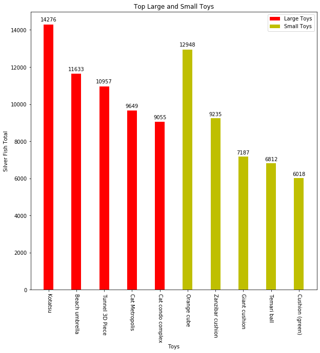

# Data-Atsume
Neko Atsume is a game with the premise of creating a playspace full of toys, furniture, and food for fictional cats to come play in. Each cat will leave fish (the fictional currency in the game) as a token of gratitude after playing in your yard. Certain toys, furniture, and food attract certain cats, certain cats give more fish than others.
 
Goal: Obtain the most fish in the most efficient manner.
 
Dataset: Community dataset created by Neko Atsume enthusiasts, detailing the average amount of fish yielded.
 
Process:
- Created a bar chart using matplotlib of average cat generosity of all cats.
- Implemented SQL queries to filter and sort through data to create desired dataset.
- Created a bar chart using matplotlib of the best toys and furniture to put out.
- Using profit maximization, concluded which toys should be put out in order of fish generated.

